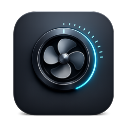
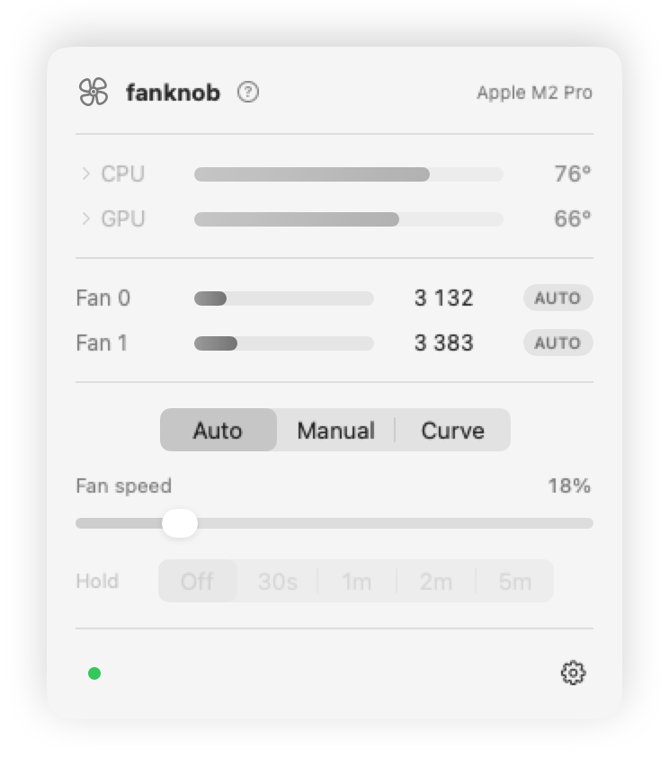
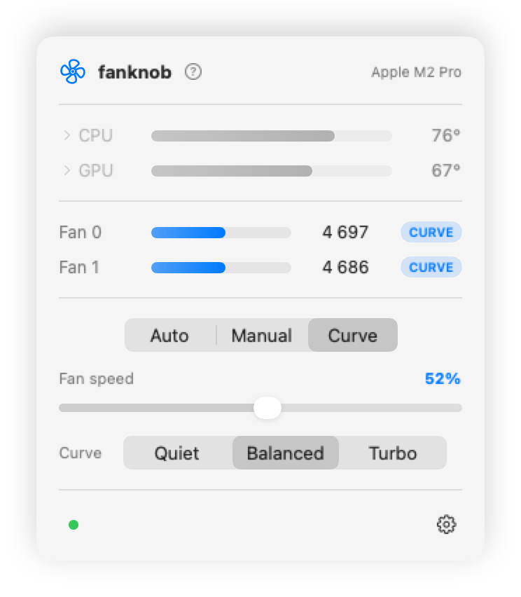

<p align="center">
  
</p>

# fanknob — fan control for Apple Silicon Macs

[](https://github.com/SadriG91/fanknob/actions/workflows/ci.yml)

Make your Mac quieter, or keep it cooler. fanknob puts your fans on a **0–100
knob** — mapped onto each fan's own min→max RPM range — and shows you what the
CPU and GPU are actually doing. Set a fixed speed, or hand the fans to a
temperature curve and let them track the heat.

It's a native menu-bar app, and a CLI and terminal dashboard if you prefer those.
Tested on a MacBook Pro 14" (M2 Pro, macOS 26).

<p align="center">
  <picture>
    <source media="(prefers-color-scheme: dark)" srcset="docs/screenshots/popover-auto-dark.png">
    
  </picture>
  <picture>
    <source media="(prefers-color-scheme: dark)" srcset="docs/screenshots/popover-curve-dark.png">
    
  </picture>
</p>
<p align="center">
  <picture>
    <source media="(prefers-color-scheme: dark)" srcset="docs/screenshots/menubar-dark.png">
    
  </picture>
  <br>
  <em>Live CPU temperature in the menu bar; the fan turns blue whenever you're the one in charge.</em>
</p>

## Install

Apple Silicon and macOS 15 or newer. One command, and fan control works the
moment it finishes:

```sh
brew install --cask SadriG91/tap/fanknob
```

No Homebrew? [Get it here](https://brew.sh) first. It's deliberately the only
way in: one thing owns the install, and one command removes it cleanly.

It installs:

| Path | |
|---|---|
| `/Applications/Fanknob.app` | the menu-bar app |
| `/usr/local/bin/fanknob` | the command line tool |
| `/usr/local/bin/fanknobd` | the background helper that does the actual fan writes |
| `/Library/LaunchDaemons/com.fanknob.daemon.plist` | starts the helper at boot |

Fanknob opens as the install finishes, so the fan icon is in your menu bar
straight away. It asks once whether to keep it there after a restart.

The installer refuses an Intel Mac or macOS 14 up front, rather than laying down
binaries that can't run.

### Updating

```sh
brew upgrade --cask fanknob
```

It replaces the running helper cleanly, and your settings survive.

### Uninstalling

```sh
brew uninstall --cask fanknob
```

The helper hands the fans back to the firmware as it's stopped, so removing
fanknob can't strand them at a fixed speed. Add `--zap` to also remove the saved
settings in `/Library/Application Support/fanknob`.

## The menu-bar app

A fan icon and the live CPU temperature sit in your menu bar. Click for:

- **CPU / GPU temperature gauges** — click one to expand the individual sensors
  behind it (an M2 Pro reports 54 CPU probes; they're die sensors, not one per
  core, so they're listed by sensor name, hottest first)
- **per-fan RPM gauges**
- an **Auto / Manual / Curve** mode picker
- a **Fan speed** slider that applies live — switch the row from *Linked* to
  *Individual* for one slider per fan
- **Quiet / Balanced / Turbo** curve presets, plus a draggable custom-curve
  editor with reusable importable/exportable profiles
- in manual mode, a **Hold**
  picker (Off / 30s / 1m / 2m / 5m) with a live countdown
- 30-minute CPU, RPM, and requested-speed history
- a gear menu with **Open at login**, safety notifications, diagnostic export,
  and the thermal safety limit
- a status light (hover it) and a header warning if the safety limit trips

It runs as a menu-bar app with no Dock icon, and never asks for your password —
the background helper does the privileged work.

> Toggle **Open at login** from the installed copy (`/Applications/Fanknob.app`)
> — login items register whichever copy is running.

## Controlling your fans

**The knob.** Every fan has its own minimum and maximum RPM. Rather than making
you memorise those, fanknob maps them to 0–100: 0 is that fan's slowest, 100 is
its fastest, and 50 is halfway. Use the slider, or:

```sh
fanknob set 40                # all fans to 40%
fanknob set 60 --fan 1        # just fan 1; the others keep their setpoints
fanknob set 60 --for 120      # hold 60% for two minutes, then back to automatic
```

Fan numbers are zero-based (`0`, `1`, …). Run `fanknob status` to see which fans
your Mac exposes before using `--fan`.

**Curves.** Instead of pinning a fixed speed, hand the fans to a curve and they
track CPU temperature for you — quiet when idle, ramping as it heats:

```sh
fanknob preset quiet          # near minimum until ~72 °C, full by 94 °C
fanknob preset balanced       # responsive without being loud
fanknob preset turbo          # keeps things cold, audibly
fanknob curve 55:0,72:20,85:60,93:100     # or roll your own °C:% points
```

The curve is re-checked every 2 seconds against a smoothed CPU average, with a
small deadband so the fans don't hunt. The watchdog independently watches the
hottest valid temperature sensor. Between your points the speed is
interpolated; outside them it's held flat. Custom curves require 2–12 points
between 20–110 °C, with temperatures at least 1 °C apart and non-decreasing
speeds.

**Thermal safety limit.** While you're overriding the fans, fanknob watches the
temperature and drives every fan to full speed if it crosses a limit — 100 °C by
default:

```sh
fanknob watchdog 90           # stricter
fanknob watchdog off          # you're on your own
```

It cools rather than surrenders. Handing the fans back would only help if the
firmware ran them harder than you are, and it cannot exceed full speed — so the
limit forces every fan to 100% and holds there until the machine is back under
it with 5 °C of headroom for two checks, then your curve or setpoint resumes.
Changing curves or setpoints while it is hot updates what will resume without
lowering the fans in the meantime. **Auto** and `watchdog off` remain explicit
ways to release the override immediately. The app shows a warning while it
lasts, and so does `fanknob status`.

**It sticks safely.** Whatever's active — a curve, a fixed speed, your safety
limit, or the absolute deadline of a timed hold — is saved and restored after a
reboot. An expired hold returns to Auto immediately; three failed temperature
checks do the same while an override is active.

**Back to normal**, any time:

```sh
fanknob auto
```

## Important

- A **fixed** speed means you own thermal management, not the firmware. The
  safety limit is the backstop (100 °C by default), but prefer a **curve** if
  you're leaving an override on — a curve responds to heat, a fixed speed
  doesn't.
- Return to auto when you're done: `fanknob auto`, the app's Auto button, or let
  a hold expire on its own.
- Fan control is system-wide. On a shared Mac, any local account can change the
  fan speed, mode and saved safety settings, so only install fanknob if you trust
  the machine's local users.
- MacBook Air is fanless — there's nothing to control there.

## Command line

```sh
fanknob status              # fans, temperatures, and what's driving them
fanknob status --json       # the same state for scripts and monitoring
fanknob diagnose --json     # privacy-safe compatibility report
fanknob tui                 # live interactive dashboard
fanknob temp                # every temperature sensor
fanknob set 40              # all fans to 40% of range
fanknob set 60 --for 120    # hold 60% for 120s, then auto-revert
fanknob set 60 --fan 1      # just one fan
fanknob preset balanced     # temperature curve
fanknob curve 55:0,90:100   # custom curve
fanknob watchdog 90         # thermal safety limit
fanknob auto                # back to automatic control
fanknob keys [prefix]       # dump raw sensor keys (default 'F')
```

Reading needs no privileges, and neither does changing speed — the background
helper handles that, so there's no `sudo` per command.

## Terminal dashboard

`fanknob tui` opens a full-screen view with live gauges and a keyboard knob:

```
 fanknob   Apple M2 Pro
 ──────────────────────────────────────────────
 Fan 0  4790 rpm  █████████████▏░░░░░░░░░░  MANUAL
 Fan 1  4778 rpm  █████████████▏░░░░░░░░░░  MANUAL
 ──────────────────────────────────────────────
 CPU   78°C  ██████████████████▊░░░░░
 GPU   69°C  ████████████████▌░░░░░░░
 ──────────────────────────────────────────────
 KNOB  55%  █████████████▎░░░░░░░░░░  MANUAL
 HOLD off
 MODE curve balanced 45:5,65:25,80:60,90:100 → 56%
 ──────────────────────────────────────────────
 ←/→ ±5  ↑/↓ ±1  0-9 speed  c curve  t hold  a auto  q quit
```

`←/→` ±5, `↑/↓` ±1, `0`–`9` jump to a speed, `c` cycles curves, `t` the hold,
`a` auto, `q` quit.

## Troubleshooting

**"helper not installed", or the status light is orange.** The background helper
isn't running, so fanknob can read your fans but not change them. Reinstalling
fixes it. To start it by hand:

```sh
sudo launchctl bootstrap system /Library/LaunchDaemons/com.fanknob.daemon.plist
```

**The fans are stuck at one speed.** Hand them back to the firmware:

```sh
fanknob auto
```

**Curves and presets do nothing.** Those need the helper running — it's what
re-evaluates the curve over time. See above.

**Still stuck?** The helper logs to `/var/log/fanknobd.log`, and `fanknob status`
prints what it thinks is going on.

## How it works

fanknob talks to your Mac's System Management Controller — the same mechanism
apps like Macs Fan Control use. Reading fan speeds and temperatures needs no
special privileges. *Changing* a fan does, so a small background helper runs as
root and does it for you.

That helper accepts only a fixed set of commands — set a speed, follow a curve,
set the safety limit, go back to automatic — and every one is range-checked
before it reaches the hardware. It can't be talked into doing anything but
moving your fans. It also hands them back to the firmware whenever it's stopped
or removed, so fanknob can't leave them stranded.

Your settings live in `/Library/Application Support/fanknob/config.json`.

## Contributing

Build instructions, the test suite, and the technical details are in
[CONTRIBUTING.md](CONTRIBUTING.md).

## License

[MIT](LICENSE)
