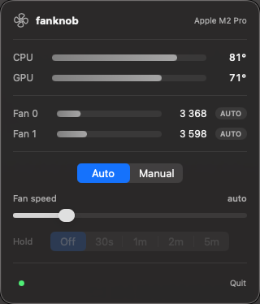
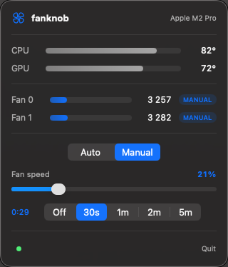
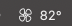

<p align="center">
  
</p>

# fanknob — fan control for Apple Silicon Macs

[](https://github.com/SadriG91/fanknob/actions/workflows/ci.yml)

Control your Mac's fans with a **0–100 knob** (mapped onto each fan's own
min→max RPM range) and monitor CPU/GPU temperatures. Three faces on one engine:

- **`fanknob`** — CLI (`status`, `temp`, `set`, `auto`, …)
- **`fanknob tui`** — live interactive terminal dashboard
- **Fanknob.app** — a native SwiftUI **menu-bar app**

It talks to the SMC directly over IOKit — the same mechanism apps like Macs Fan
Control use. Tested on a MacBook Pro 14" (M2 Pro, macOS 26).

<p align="center">
  
  &nbsp;&nbsp;
  
</p>
<p align="center">
  
  <br>
  <em>Live CPU temperature in the menu bar; the fan turns accent-colored while in manual mode.</em>
</p>

## Layout

```
Package.swift
Sources/
  FanknobCore/   shared engine: SMC access, fan/temp model, daemon client
  fanknob/       CLI + TUI
  fanknobd/      root daemon (privileged writes)
  FanknobApp/    SwiftUI menu-bar app
app/Info.plist   app bundle metadata
com.fanknob.daemon.plist
```

## Install with Homebrew (recommended)

```sh
brew install SadriG91/tap/fanknob

# fan control needs the root helper daemon (one time):
sudo brew services start fanknob

# optional: put the menu-bar app in /Applications
cp -R "$(brew --prefix)/opt/fanknob/Fanknob.app" /Applications/
```

Installs a prebuilt bottle in seconds — **no Xcode required**. If no bottle
matches your system, Homebrew falls back to building from source (which needs
Xcode 16+).

### Updating

```sh
brew update && brew upgrade fanknob
sudo brew services restart fanknob
```

## Build from source

```sh
git clone https://github.com/SadriG91/fanknob.git
cd fanknob
make app             # build everything + assemble Fanknob.app
sudo make install    # install CLI + daemon + app, load the daemon
```

> Use ONE install method — Homebrew or `make install`, not both.

All targets:

```sh
make                 # build everything (release)
make app             # assemble build/Fanknob.app
make run-app         # build + launch the menu-bar app
sudo make install    # install CLI + daemon + app to the system, load the daemon
sudo make uninstall
```

> If you hit an Xcode license error building the app:
> `sudo xcodebuild -license accept`

The one-time `sudo` on install is unavoidable: granting future passwordless root
access requires proving you're root once. After that the root daemon performs
the writes, and the CLI/app stay unprivileged — no `sudo` per command.

## The menu-bar app

`make run-app` (or `open -a Fanknob` after install) puts a fan icon + live CPU
temperature in your menu bar. Click it for:

- CPU / GPU temperature gauges (green→red) and per-fan RPM gauges
- a **Knob** slider (0–100%) that applies live via the daemon
- an **Auto** button and a **Hold** picker (Off / 30s / 1m / 2m / 5m) with a
  live countdown — the fans revert to automatic on their own
- a status line showing whether the helper daemon is connected

It runs as a menu-bar agent (no Dock icon). Writes go through the daemon, so the
app never needs elevated privileges.

## CLI

```sh
fanknob status              # fans + CPU/GPU temperature   (no sudo)
fanknob tui                 # live interactive dashboard
fanknob temp                # every temperature sensor
fanknob set 40              # all fans to 40% of range      (no sudo — via daemon)
fanknob set 60 --for 120    # hold 60% for 120s, then auto-revert
fanknob auto                # back to automatic control
fanknob keys [prefix]       # dump SMC keys (default 'F')
```

Reads need no privileges. `set`/`auto` go through the root daemon if installed,
otherwise run them with `sudo`.

## TUI

`fanknob tui` opens a full-screen dashboard with live gauges and a keyboard knob:

```
 fanknob   Apple M2 Pro
 ──────────────────────────────────────────────
 Fan 0  3301 rpm  █████▎░░░░░░░░░░░░░░░░░░  auto
 CPU   81°C  ███████████████████▍░░░░
 KNOB  22%  █████▎░░░░░░░░░░░░░░░░░░  MANUAL
 HOLD  1:45 → auto
 ──────────────────────────────────────────────
 ←/→ ±5  ↑/↓ ±1  1-9 preset  t hold  a auto  q quit
```

`←/→` ±5, `↑/↓` ±1, `1`–`9` presets, `t` cycles the hold, `a` auto, `q` quit.

## Testing

```sh
make test      # unit tests: SMC codecs, knob math, temp clustering, daemon protocol
make ui-test   # UI acceptance: real synthetic clicks on the app's Auto/Manual toggle
```

`ui-test` is a regression test for the "sticky toggle" bug (the SMC reports the
old fan mode for tens of ms after a write; the app must not let a stale poll
yank the toggle back). It drives real CGEvent clicks, so it needs the app
running, the daemon installed, and Accessibility permission for the terminal.

## Important

- **Return to auto when done** (`fanknob auto`, the app's Auto button, or let a
  hold expire). In manual mode you own thermal safety, not the firmware — don't
  leave fans pinned low under load.
- MacBook Air is fanless; nothing to control there.

## How it works

Per fan `i`, the SMC exposes `FNum` (count), `FiAc` (actual RPM), `FiMn`/`FiMx`
(min/max), `FiTg` (target RPM, `flt`), `FiMd` (mode: 0 = auto, 1 = manual). To
force a speed: write `1` to `FiMd`, then the target RPM to `FiTg`. To release:
write `0` to `FiMd`.

**Temperature:** Apple Silicon has no single documented "CPU temp" key. fanknob
scans all `T…` sensors of type `flt` in a plausible range and reports the average
of the CPU-core (`Tp*`) and GPU (`Tg*`) clusters.

### The 80-byte struct gotcha

The kernel's `SMCKeyData_t` is exactly 80 bytes. Swift reuses a nested struct's
trailing padding for the next field (C does not), which silently packs the param
struct to 76 bytes and makes every `IOConnectCallStructMethod` fail with
`kIOReturnBadArgument`. `SMCKeyInfoData` is padded to a full 12 bytes to prevent
this — see the comment in `Sources/FanknobCore/SMC.swift`.

### Daemon security

The root daemon accepts only two commands (`set <0-100> [seconds]`, `auto`) over
its socket, so even though any local user can connect, it can't be driven to do
anything but move the fans.

The daemon is also a system-wide singleton (flock on `/var/run/fanknobd.lock`):
if a second instance starts — say a Homebrew-managed daemon next to a
`make install` one — it refuses to run instead of stealing the socket, and its
launchd keep-alive retries mean it takes over automatically if the first one is
ever stopped.

## License

[MIT](LICENSE)
